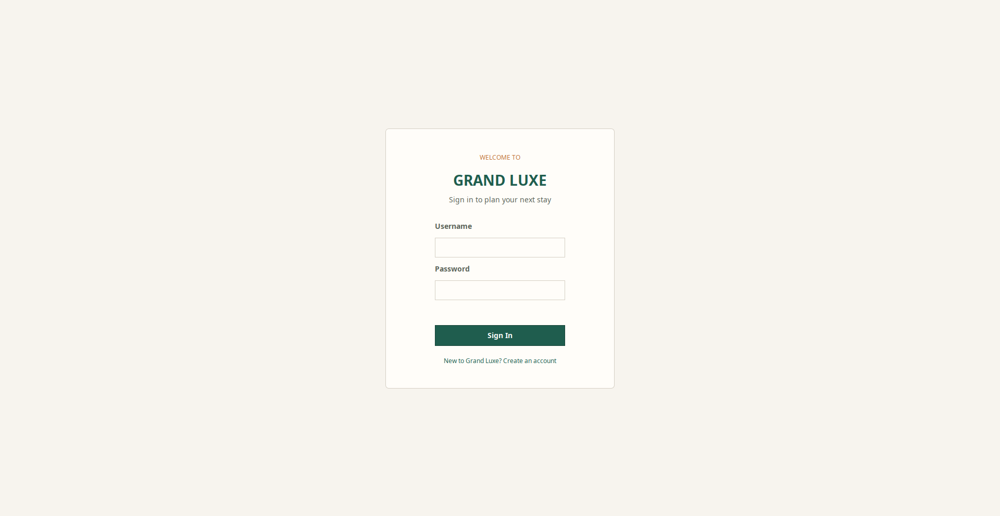
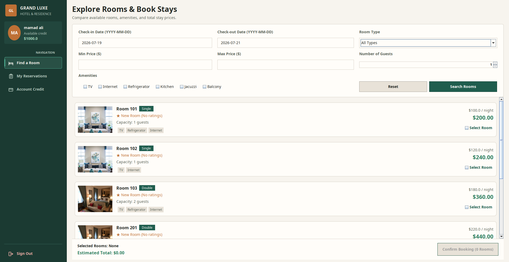
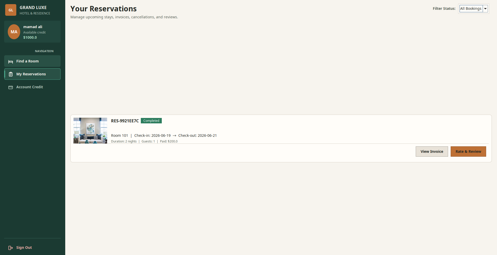
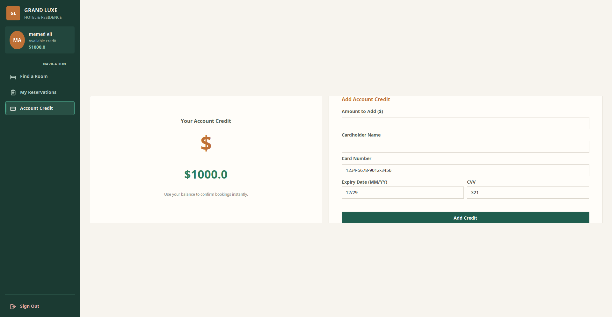

# 🏨 Grand Luxe Hotel & Residence Reservation System

This is a premium, fully-featured Java Swing Graphical User Interface (GUI) desktop application for hotel and residence reservations. It is designed with a modern dark theme and implements standard reservation features along with advanced rules like dynamic discounts, multi-booking, refund calculations, check-in alerts, and automated invoice PDF/text generation.

---

## 📸 Screenshots

| Login Page | Explore Rooms |
|------------|---------------|
|  |  |

| My Reservations | Account Credit |
|-----------------|----------------|
|  |  |

---

## ⚙️ Features Implemented

### 👤 User Registration & Authentication
- **Register:** Account creation by entering First Name, Last Name, Username, and Password. Users start with a **default credit of $1000.00**.
- **Login:** Session-based authentication against SQLite database (`data/hotel.db`).
- **Auto-Reminder Banner:** On successful login, the user receives an alert if they have an active check-in scheduled within the next 24 hours.

### 🛏️ Room Management
- Room inventory is loaded from SQLite database (`data/hotel.db`), which auto-populates default rooms on first launch if empty.
- Displays room numbers, types (Single, Double, Suite), capacity (max guests), pricing, amenities, and average guest rating.
- Interactive filtering by:
  - Check-in & Check-out dates.
  - Room Type (Single, Double, Suite).
  - Price Range (Min/Max dollars).
  - Guest capacity requirements.
  - Multi-select amenities checkboxes (TV, Internet, Refrigerator, Kitchen, Jacuzzi, Balcony).

### 🔍 Date Overlap & Availability Check
- Standard overlap algorithm: A room is available for $[I_1, O_1]$ if there is no booking $[I_2, O_2]$ such that $I_1 < O_2$ and $O_1 > I_2$ for active bookings.
- Double bookings are prevented. Rooms already reserved for the selected period are hidden from the search results.

### 📅 Room Reservation (Multi-Booking)
- Select multiple rooms and book them together in a single transaction.
- Calculates and displays the estimated total price in real time.
- Validates dates (e.g. check-in cannot be in the past, checkout must be after check-in).
- Checks user credit balance. If insufficient, throws `InsufficientCreditException` and blocks booking.
- Deducts total cost, updates account balance, saves booking files, and prints a receipt invoice.

### 📋 Reservation History & Refunds
- View full booking history (Active, Completed, Cancelled).
- Filters for viewing bookings based on their statuses.
- **Cancellation & Refunds:**
  - Cancel $> 48$ hours before check-in date: **100% full refund**.
  - Cancel $\le 48$ hours before check-in date: **50% partial refund**.
  - Restores refunded credit immediately to user's wallet.
- **Auto-Complete:** On startup/history-load, bookings whose check-out dates have passed automatically advance their status to `Completed`.

### 💰 Credit Recharge
- Simulated payment checkout card to refill credit.
- Validates refill amount, mock credit card numbers, expiry dates, CVVs, and cardholder names.
- Updates wallet balances instantly.

### ⭐ Ratings & Reviews (Bonus)
- Allows guests to submit a rating (1-5 stars) and a textual review for rooms they have successfully completed staying in.
- Dynamically recalculates and displays the average room rating in the search lists.

### 📄 Invoice Generation (Bonus)
- Prints a beautifully formatted receipt text file under `invoices/invoice_[reservationId].txt` containing billing details, date issued, room numbers, nights, and discount logs.
- Status of invoice files automatically updates to `CANCELLED (Refunded $X)` or `COMPLETED` when relevant events occur.

---

## 🛠️ Code Architecture (Object-Oriented Design)

The project adheres to high-quality OOP design principles (Inheritance, Encapsulation, Polymorphism):

- **`hotel.model` (Models):**
  - [User.java](src/hotel/model/User.java) - Holds name, username, password, credit. Encapsulates credit mutations.
  - [Room.java](src/hotel/model/Room.java) - Details room number, type, capacity, amenities list.
  - [Reservation.java](src/hotel/model/Reservation.java) - Records booking metadata, check-in/out dates, and status enum.
  - [Review.java](src/hotel/model/Review.java) - Encapsulates user reviews and ratings.
- **`hotel.db` (Database):**
  - [SqliteDatabase.java](src/hotel/db/SqliteDatabase.java) - Handles database tables initialization, SQLite JDBC connection, automated data migration from .txt files, and CRUD operations.
- **`hotel.service` (Business Logic):**
  - [HotelService.java](src/hotel/service/HotelService.java) - Centralized logic: overlap validation, early booking discounts, cancellation refunds, invoice creation, and user management.
- **`hotel.exception` (Exceptions):**
  - Custom exceptions (`HotelException`, `InsufficientCreditException`, `RoomUnavailableException`, `InvalidBookingDatesException`) ensure errors are handled robustly.
- **`hotel.ui` (Graphical Interface):**
  - [Theme.java](src/hotel/ui/Theme.java) - Standardizes dark-mode colors, fonts, hover animations, and custom borders.
  - [MainFrame.java](src/hotel/ui/MainFrame.java) - Application shell, session state tracker, and view switcher.
  - [LoginPanel.java](src/hotel/ui/LoginPanel.java) & [RegisterPanel.java](src/hotel/ui/RegisterPanel.java) - Authentication screens.
  - [DashboardPanel.java](src/hotel/ui/DashboardPanel.java) - Left sidebar navigations and right panel switcher.
  - [RoomsPanel.java](src/hotel/ui/RoomsPanel.java) - Interactive room grids and multi-booking logic.
  - [BookingsPanel.java](src/hotel/ui/BookingsPanel.java) - Booking cards, cancel requests, review modals, and invoice file viewer.
  - [CreditPanel.java](src/hotel/ui/CreditPanel.java) - Recharge checkout form.

---

## 📁 File Structure

```text
hotel-reservation-system/
├── data/
│   ├── hotel.db          # SQLite database containing users, rooms, reservations, reviews
│   └── *.txt.bak         # Archived original file-based database copies (after auto-migration)
├── invoices/             # Automatically populated text invoice receipts
│   └── invoice_RES-XXXX.txt
├── src/
│   └── hotel/
│       ├── db/
│       ├── exception/
│       ├── model/
│       ├── service/
│       ├── ui/
│       └── Main.java
├── bin/                  # Generated class files
├── run.sh                # Automation compilation & runner script
└── README.md
```

---

## 🚀 How to Compile & Run

### 📋 Prerequisites
- **Java Development Kit (JDK):** Version 11 or higher (Java 26 recommended/supported).

### 🖥️ Run via Automation Script (Linux/macOS)
1. Open a terminal in the application root directory (`/home/omid/Code/study/ap/hotel-reservation-system`).
2. Run the shell script:
   ```bash
   ./run.sh
   ```

### 🔨 Manual Command Line Run
Alternatively, you can compile and execute manually:
1. Compile all source files into the `bin` folder:
   ```bash
   mkdir -p bin
   find src -name "*.java" | xargs javac -d bin
   ```
2. Execute the application:
   ```bash
   java -cp bin hotel.Main
   ```
